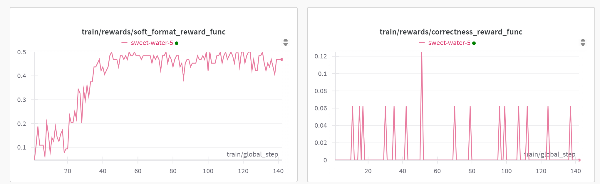
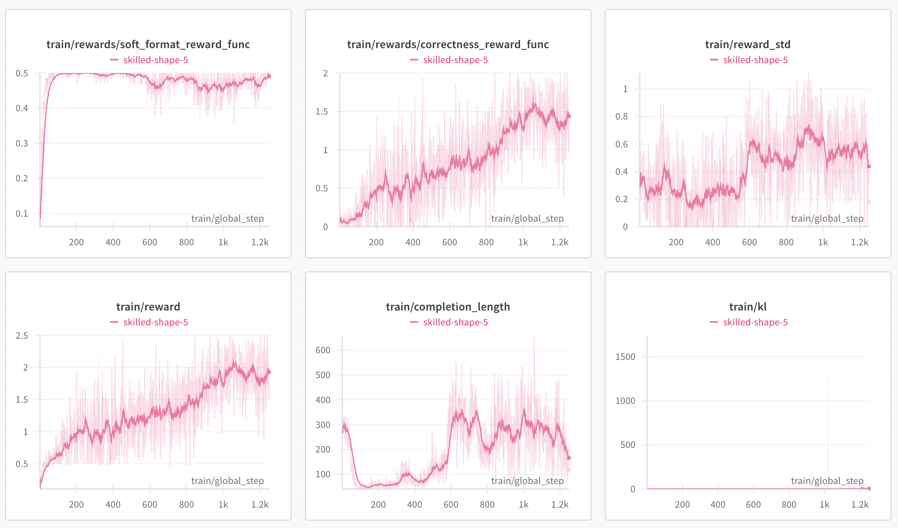

# CountDown Game Distill SFT and RL

## 0. 环境搭建

```bash
conda create -n countdown python=3.10
conda activate countdown
pip install -r requirements.txt

cp env.template .env
# 后续部分环节需要修改 .env 中的 API Key。
```

## 1. 准备数据

使用 `1_prepare_data.ipynb` 准备数据集，并保存到 data/ 目录下。

## 2. 基座模型评测

使用 `2_eval_basic.ipynb` 评测选择的基座模型在数据集上的表现。

作业：

- 编写简单的 result_view.py 脚本，打印出评估结果中原因分布。

## 3. 合成简单的 SFT 数据

使用 `3_sft_data_simple.ipynb` 合成简单 SFT 数据。

合成最简化的正确答案。

## 4. 简单SFT 训练

使用 `4_sft_train_simple.ipynb` 简单 SFT 训练。

## 5. 蒸馏 DeepSeek R1 模型

使用 `5_distill_deepseek_r1.ipynb` 蒸馏 DeepSeek R1 模型。

## 6. 使用蒸馏数据进行 SFT 训练

使用 `6_sft_train_distill.ipynb` 使用蒸馏数据进行 SFT 训练。

基座模型： Qwen2.5-1.5B-Instruct

作业：

- 编写 `6_sft_train_distill_reasoning.ipynb` 使用蒸馏数据进行 SFT 训练。
- 基座模型： DeepSeek-R1-Distill-Qwen-1.5B
- 主要是 Prompt 的不同。


## 7. 进行 GRPO RL 训练

使用 `7_rl_train_grpo.ipynb` 进行 GRPO RL 训练。

### 7.1 尝试1：1.5B 模型 + 1000 条复杂数据 + 直接 RL

参数：

- 基座模型： Qwen2.5-1.5B-Instruct
- 训练数据： 1000 条复杂数据
- 训练轮数： 2
- beta： 0.04
- 学习率： 5e-6
- 学习率调度器：cosine

结果：

- 过难拿不到正确性奖励，格式奖励打满后模型开始无变化。



### 7.2 尝试2：1.5B 模型 + 1000 条简单数据 + 直接 RL

参数：

- 基座模型： Qwen2.5-1.5B-Instruct
- 训练数据： 1000 条简单数据
- 训练轮数： 5
- beta： 0.001（beta越小，KL散度惩罚越小，模型学习更自由）
- 学习率： 5e-6
- 学习率调度器：constant

结果：



### 7.4 v4：1.5B 模型 + 10000 条简单数据 + RL + 3.5K 输出

参数：

- 基座模型： Qwen2.5-1.5B-Instruct
- 训练数据： 10000 条复杂数据
- 训练轮数： 5000 steps（实际跑到1600 steps）
- Batch_size：8（是 num_generations 的倍数）
- 梯度累积：4（保证总batch_size 为32）
- beta： 0.001（beta越小，KL散度惩罚越小，模型学习更自由）
- 学习率： 5e-6
- 学习率调度器：linear
- max_seq_length: 4096（输入512，输出3584）

模型学习的更好，而且数据没有重复，可以观察到正确率会不断提升。限于资源没有继续。


